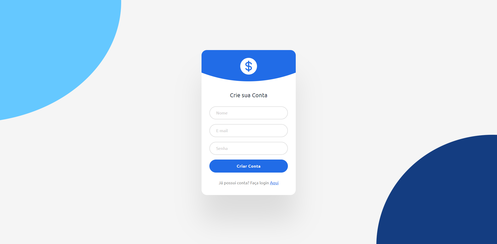

<h1 align="center">Tela de Login 📝</h1>

Tela de Login

  <a href="#-tecnologias">Tecnologias</a>&nbsp;&nbsp;&nbsp;|&nbsp;&nbsp;&nbsp;
  <a href="#-projeto">Projeto</a>&nbsp;&nbsp;&nbsp;
  

 

  

## 🚀 Tecnologias

Esse projeto foi desenvolvido com as seguintes tecnologias:

- HTML, CSS
- Git e Github

## 💻 Projeto

A página de Título: Tela de Login é um estudo individual Inspirado no Bootcamp do ASMR Prog. O idioma foi traduzido para o portugês.

- [Acesse o projeto finalizado, online](https://viniciuszmota.github.io/Tela-de-login-1/)

---

Feito por Vinicius Zamprogno Mota 👨‍💻

